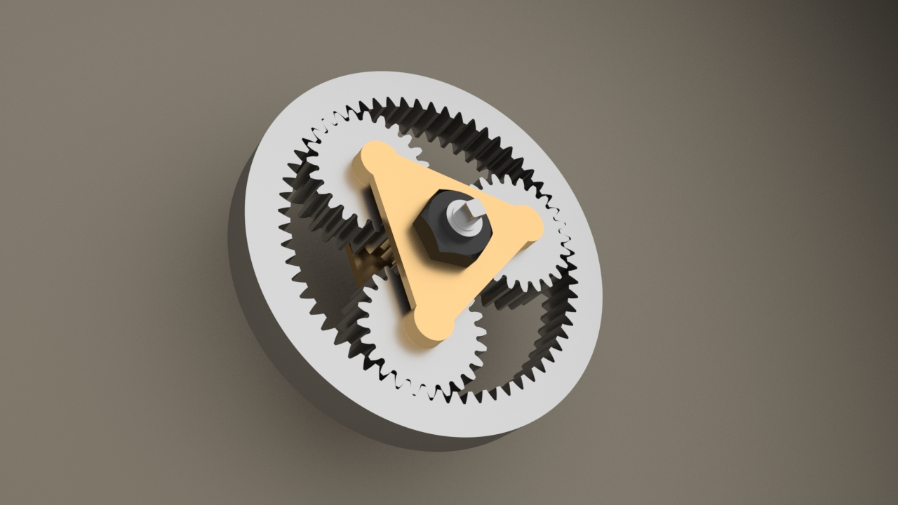

# Introduction
> The long-term goal for this project is to provide a **simple** and **straightforward** view of some basic concepts and structures in mathematics, physics, engineering and even music. We use [Blender](https://www.blender.org/), an open-source and powerful tool to create scientific models and take advantage of its built-in [Cycles](https://www.cycles-renderer.org/) renderer to make every scene cool and vivid.

## Möbius Strip
The Möbius strip or Möbius band, is a surface with only one side (when embedded in three-dimensional Euclidean space) and only one boundary. The Möbius strip has the mathematical property of being unorientable. It can be realized as a ruled surface. *[from [Wikipedia](https://en.wikipedia.org/wiki/M%C3%B6bius_strip)]*
> 
## Mechanical Device
> 
## Planetary Gear Drive
> 
## Reuleaux Triangle
> 
## Ruled Surface
> 
## Ukulele
The ukulele is a member of the lute family of instruments. It generally employs four nylon or gut strings or four courses of strings. Some strings may be paired in courses, giving the instrument a total of six or eight strings.  

The ukulele originated in the 19th century as a Hawaiian adaptation of the Portuguese machete, a small guitar-like instrument, which was introduced to Hawaii by Portuguese immigrants, mainly from Madeira and the Azores. It gained great popularity elsewhere in the United States during the early 20th century and from there spread internationally.

The tone and volume of the instrument vary with size and construction. Ukuleles commonly come in four sizes: soprano, concert, tenor, and baritone.*[from [Wikipedia](https://en.wikipedia.org/wiki/Ukulele)]*
> 
