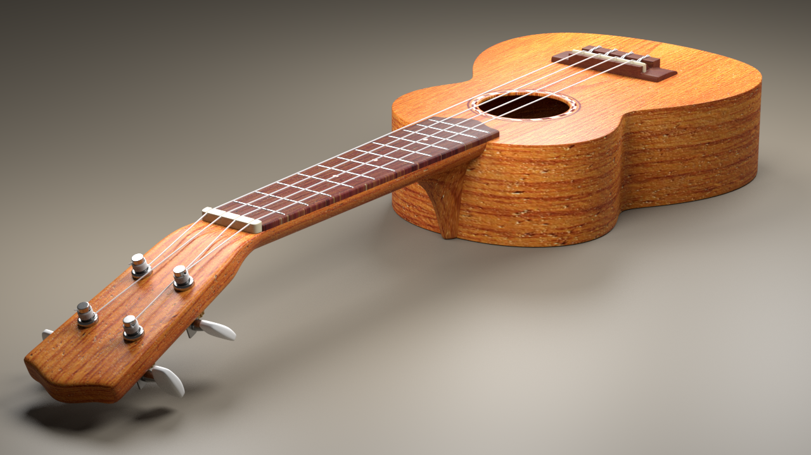

# Introduction
> The long-term goal for this project is to provide a **simple** and **straightforward** view of some basic concepts and structures in mathematics, physics, engineering and even music. We use [Blender](https://www.blender.org/), an open-source and powerful tool to create scientific models and take advantage of its built-in [Cycles](https://www.cycles-renderer.org/) renderer to make every scene cool and vivid.

## Möbius Strip
> - The Möbius strip or Möbius band, is a surface with only one side (when embedded in three-dimensional Euclidean space) and only one boundary. The Möbius strip has the mathematical property of being unorientable. It can be realized as a ruled surface. *[from [Wikipedia](https://en.wikipedia.org/wiki/M%C3%B6bius_strip)]*
> 
## Planetary Gear Drive
> - A planetary gear drive consists of two gears mounted so that the centre of one gear revolves around the centre of the other. A carrier connects the centres of the two gears and rotates to carry one gear, called the **planet gear**, around the other, called the **sun gear**. The planet and sun gears mesh so that their pitch circles roll without slip. A point on the pitch circle of the planet gear traces an epicycloid curve. In this simplified case, the sun gear is fixed and the planetary gear(s) roll around the sun gear.*[from [Wikipedia](https://en.wikipedia.org/wiki/Epicyclic_gearing)]*
> 
Check out below for how it works:
> 
## 3D Reuleaux Triangle
> - A Reuleaux triangle is a shape formed from the intersection of three circular disks, each having its center on the boundary of the other two. Its boundary is a curve of constant width, the simplest and best known such curve other than the circle itself. Constant width means that the separation of every two parallel supporting lines is the same, independent of their orientation.*[from [Wikipedia](https://en.wikipedia.org/wiki/Reuleaux_triangle)]* 
> 
## Ruled Surface
> - In geometry, a surface **S** is ruled (also called a scroll) if through every point of **S** there is a straight line that lies on **S**. Examples include the plane, the curved surface of a cylinder or cone, a conical surface with elliptical [directrix](https://en.wikipedia.org/wiki/Conic_section#Eccentricity,_focus_and_directrix), the right conoid, the helicoid, and the tangent developable of a smooth curve in space.*[from [Wikipedia](https://en.wikipedia.org/wiki/Ruled_surface)]* 
> 
> - Take a look at this magic. It is counter-intuitive to see a straight rod can easily pass through a bending hole.
> 
## Mechanical Device
> - Some common mechanical devices which you may find in your car.
> 
> 
> - See below for how they work!
> 
> 
## Ukulele
> - The ukulele is a member of the lute family of instruments. It generally employs four nylon or gut strings or four courses of strings. Some strings may be paired in courses, giving the instrument a total of six or eight strings.  
>  
> - The ukulele originated in the 19th century as a Hawaiian adaptation of the Portuguese machete, a small guitar-like instrument, which was introduced to Hawaii by Portuguese immigrants, mainly from Madeira and the Azores. It gained great popularity elsewhere in the United States during the early 20th century and from there spread internationally.
>  
> - The tone and volume of the instrument vary with size and construction. Ukuleles commonly come in four sizes: soprano, concert, tenor, and baritone.*[from [Wikipedia](https://en.wikipedia.org/wiki/Ukulele)]*
> 
