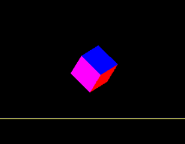

# Abstract
> This project is for [CS523 Computer Graphics](https://orionquest.github.io/CS523/).  
> In this project, basic physical laws are implemented. The rigid solid cube will undergo movements, rotations, as well as collisions. 
> The following steps are included: 
> - Implement the unconstraint movements of a given rigid body. Use ODE to update properties like location, velocity, angular momentum, etc.
> - Take collisions into account and disallow inter-penetration.    
> - Typical result is shown below:  
>   
>  
> View my [technical report](../report.pdf) for more details.  
> View my [demo](./results/video1.mp4) [videos](./results/video2.mp4).  
> View my [source code](./code).
